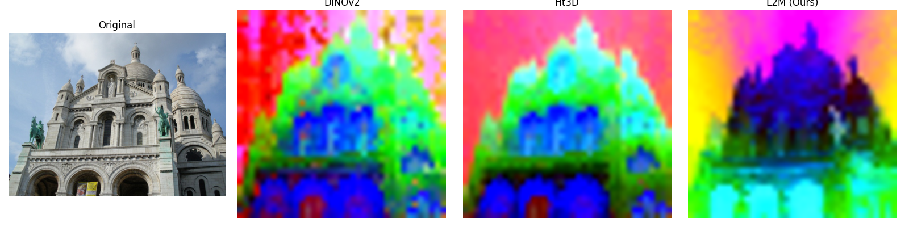
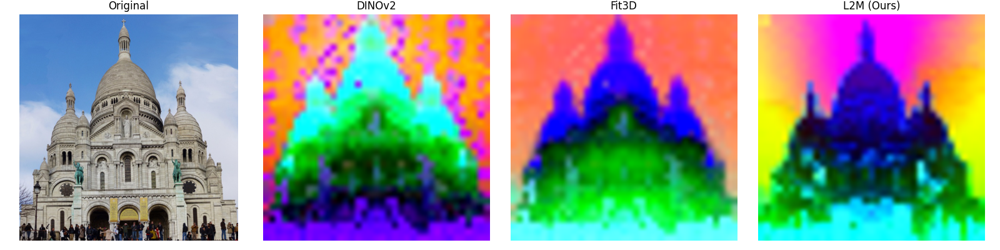

# Lift to Match (L2M): Learning Dense Feature Matching via Lifting Single 2D Image to 3D Space

*Accepted to ICCV 2025 Conference*

---

## 🧠 Overview

**Lift to Match (L2M)** is a two-stage framework for **dense feature matching** that lifts 2D images into 3D space to enhance feature generalization and robustness. Unlike traditional methods that depend on multi-view image pairs, L2M is trained on large-scale, diverse single-view image collections.

- **Stage 1:** Learn a **3D-aware ViT-based encoder** using multi-view image synthesis and 3D Gaussian feature representation.
- **Stage 2:** Learn a **feature decoder** through novel-view rendering and synthetic data, enabling robust matching across diverse scenarios.

> 🚧 Code under construction.

---

## 🧪 Feature Visualization

We compare the 3D-aware ViT encoder from L2M (Stage 1) with other recent methods:

- **DINOv2**
- **FIT3D**
- **Ours: L2M Encoder**

Below are feature comparison results on the Sacré-Cœur dataset:

<div align="center">
  
  <br/>
</div>

<div align="center">
  
  <br/>
</div>

---

To get the results, make sure your checkpoints and image files are in the correct paths, then run:
```
python vis_feats.py \
  --img_paths assets/sacre_coeur_A.jpg assets/sacre_coeur_B.jpg \
  --ckpt_dino ckpts/dinov2.pth \
  --ckpt_fit3d ckpts/fit3d.pth \
  --ckpt_L2M ckpts/output_20250629/l2m_vit_base.pth \
  --save_dir outputs_vis_feat
```

## 🏗️ Data Generation

We synthesize novel-view images with dense matching labels from single-view inputs for training.  
Scripts for data generation will be released soon.


## 🙋‍♂️ Acknowledgements

We build upon recent advances in ROMA and FIT3D.
